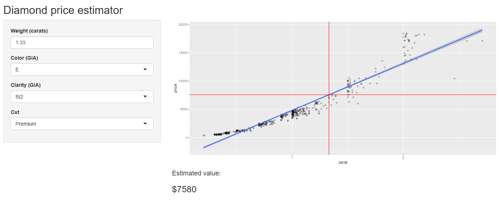

```{r setup, include=FALSE}
knitr::opts_chunk$set(echo = FALSE)
```
```{r echo=FALSE}
suppressWarnings(library(dplyr, quietly = TRUE, warn.conflicts = FALSE))
suppressWarnings(library(ggplot2, quietly = TRUE, warn.conflicts = FALSE))
data(diamonds)
ds1 <- diamonds[, c(1:4, 7)]
```
## *How much is my diamond worth?*

(And how many times have your clients asked this question?)

Now you can get a head start on the initial appraisal.

The Diamond Price Estimator uses data from over *50,000* graded and priced diamonds to build a value prediction model based upon the 'Four Cs'.

### How does it work?

Based on options *you* select for Color, Cut, and Clarity, a model specific to those parameters is built 'on-the-fly' to predict value from Carat weight.

- GIA color grades D through J
- GIA clarity grades IF through I2
- Cut quality from Fair to Ideal
- Weights ranging from 0.15 to 5.00 carats

*Sufficient to handle the majority of diamonds encountered in the retail trade!*

*We know you value your reputation: if your input parameters are outside the confidence of the model, we'll tell you - so you keep the confidence of your clients.*

***
## The model in action:

Let's posit that we have a diamond to appraise:

- It's almost perfectly colorless: the GIA color is 'E'
- It's slightly included, and we feel it's a GIA clarity grade of SI2
- The cutter did a fine job, and we can call it a premium-grade cut.

We provide those parameters to the Diamond Price Predictor's user interface, which sets up the model.
```{r echo=FALSE}
dset <- ds1 |> 
    filter(grepl('Premium', cut), grepl('E', color), grepl('SI2', clarity))
    value_model <- lm(price ~ carat, dset)
```


And then provide the weight of the diamond we have in hand, which happens to be 1.33 carats, to see an estimated value (rounded to the nearest $10):
```{r echo=TRUE}
carat_in <- 1.33
est_price <- predict(value_model, newdata = data.frame(carat = carat_in))
print.default(paste0('Estimated value: $', round(est_price, -1)))
```
***
**In the application, the estimate is presented both numerically and graphically in relation to the data used to build the model.**

The estimate we got in the previous slide would be presented as: 


{width=90%}

***

### Try the live application:

http://freyjukettir.shinyapps.io/Diamond_Price_Estimator

### Project files repository at GitHub:

http://github.com/freyjukettir/


<div align="center">
  
  <p><strong>Luna thanks you for your attention!</strong></p>
</div>